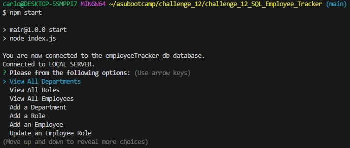

# Employee Tracker

## Description

As a webstack developer I want to create a database to demonstrate information for a client.
A great way to demonstrate a structured query to a client of a small buisness would be an application that tracks employee status.


## Table of Contents

- [Installation](#installation)
- [Usage](#usage)
- [License](#license)
- [Contribution](#contribution)
- [Future Development](#future-development)

## Installation

Use following prompts on designated terminal to use the application properly. 
1. npm init
2. npm i
3. npm install inquirer
4. npm install --save mysql2
5. npm install dotenv --save

To run application please use following command in local terminal: 
```
npm run start
```

## Usage



[Walkthrough Video](https://youtu.be/D0RcKzO4VS4)

- https://www.npmjs.com/package/mysql2
- https://www.npmjs.com/package/dotenv

## License

This is free and unencumbered software released into the public domain.

Anyone is free to copy, modify, publish, use, compile, sell, or
distribute this software, either in source code form or as a compiled
binary, for any purpose, commercial or non-commercial, and by any
means.

In jurisdictions that recognize copyright laws, the author or authors
of this software dedicate any and all copyright interest in the
software to the public domain. We make this dedication for the benefit
of the public at large and to the detriment of our heirs and
successors. We intend this dedication to be an overt act of
relinquishment in perpetuity of all present and future rights to this
software under copyright law.

THE SOFTWARE IS PROVIDED "AS IS", WITHOUT WARRANTY OF ANY KIND,
EXPRESS OR IMPLIED, INCLUDING BUT NOT LIMITED TO THE WARRANTIES OF
MERCHANTABILITY, FITNESS FOR A PARTICULAR PURPOSE AND NONINFRINGEMENT.
IN NO EVENT SHALL THE AUTHORS BE LIABLE FOR ANY CLAIM, DAMAGES OR
OTHER LIABILITY, WHETHER IN AN ACTION OF CONTRACT, TORT OR OTHERWISE,
ARISING FROM, OUT OF OR IN CONNECTION WITH THE SOFTWARE OR THE USE OR
OTHER DEALINGS IN THE SOFTWARE.

For more information, please refer to <https://unlicense.org>


## Contribution

Best way to contribute will be to comment on the code to suggest how this application can be improved and collaborate to create a seemless app to improve upon.

## Future Development

Use front end skills to create an interactive website for the client.
The ability to add additional queries tailored to the client.